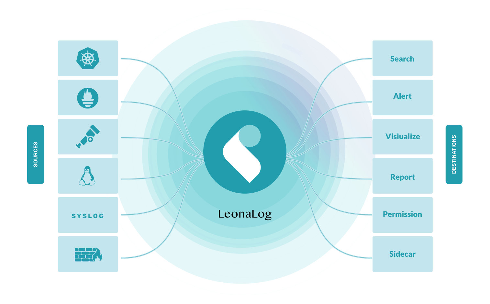

<div align="right">
    
</div>
<div align="center">
    
    <br />
    <small>Security and Log Data Done Right</small>
</div>

# Leona

[](https://www.mongodb.com/licensing/server-side-public-license)
[](http://mvnrepository.com/artifact/org.graylog2/graylog2-server)
[](https://github.com/Graylog2/graylog2-server/actions/workflows/build.yml)



Welcome! A centralized Log Management System (LMS) like LeonoLog provides a means to aggregate, organize, and make sense of all this data

You can read more about the project on our [LeonaLog Tutorial](https://ciusji.gitbook.io/leona).

## Main Features

There are many features that enhance LeonaLog usefulness as a flexible tool:

- Streams operate as a form of tagging for incoming messages. Streams route messages into categories in real time, and team rules instruct LeonaLog to route messages into the appropriate stream.
- The LeonaLog Search page is the interface used to search logs directly. LeonaLog uses a simplified syntax, very similar to Lucene. Relative or absolute time ranges are configurable from drop down menus. Searches may be saved or visualized as dashboard widgets that may be added directly to dashboards from within the search screen.
- Users may configure their own views and may choose to see either a summary or complete data from event messages.
- LeonaLog Dashboards are visualizations or summaries of information contained in log events. Each dashboard is populated by one or more widgets. Widgets visualize or summarize event log data with data derived from field values such as counts, averages, or totals. Users can create indicators, charts, graphs, and maps to visualize the data.
- Alerts are created using Event Definitions that consist of Conditions. When a given condition is met it will be stored as an Event and can be used to trigger a notification.
- An Index is the basic unit of storage for data in OpenSearch and Elasticsearch. Index sets provide configuration for retention, sharding, and replication of the stored data. Values, like retention and rotation strategy, are set on a per-index basis, so different data may be subjected to different handling rules.
- LeonaLog's Processing Pipelines enable the user to run a rule, or a series of rules, against a specific type of event. Tied to streams, pipelines allow routing, denylisting, modification, and enrichment of messages as they flow through LeonaLog.

## Quickstart

```shell
git clone git@github.com:LeonaLog/leona.git
cd leona
# JAVA_HOME=?17.jdk/Contents/Home !!!
mvn clean package -DskipTests

# Start server in dev model
java -cp org.graylog2.bootstrap.Main server --configfile=/Users/admin/.graylog/server/server.conf

# Start web in dev model
cd graylog2-web-interface
yarn start
```

Server configuration detail:

```shell
# Leona Server Configuration
## General
is_leader = true
node_id_file = ./server-node-id
password_secret = IHRzmjWfc0mh7D1Pepv7Od6NRL7jqNb0k9g8fvjwyX4Vq1KIHvQSFOHLf4BO1k3hdKdFWmceKwy46BGqIk2NurWAUYSedspb
root_username = admin
root_password_sha2 = 8c6976e5b5410415bde908bd4dee15dfb167a9c873fc4bb8a81f6f2ab448a918
rest_listen_uri = http://127.0.0.1:12900/

## Web & REST API
http_bind_address = 127.0.0.1:9000

## Elasticsearch / OpenElasticsearch
elasticsearch_max_docs_per_index = 20000000
elasticsearch_index_prefix = graylog
elasticsearch_max_number_of_indices = 20
elasticsearch_shards = 1
elasticsearch_replicas = 0
elasticsearch_hosts = http://xxx:9200
elasticsearch_analyzer = standard
elasticsearch_disable_version_check = true

## Rotation
output_batch_size = 5000
processbuffer_processors = 5
outputbuffer_processors = 5
processor_wait_strategy = sleeping
ring_size = 1024

## MongoDB
mongodb_uri = mongodb://xxx:27017/graylog
mongodb_max_connections = 100
mongodb_threads_allowed_to_block_multiplier = 5
```

## Documentation

- [Overview](https://ciusji.gitbook.io/leona)
- Installation
  - [Docker](https://ciusji.gitbook.io/leona/installation/docker)
  - [Manual Setup](https://ciusji.gitbook.io/leona/installation/manual-setup)
- Configuration
  - [Server Conf](https://ciusji.gitbook.io/leona/configuration/server-conf)
  - [Web Interface](https://ciusji.gitbook.io/leona/configuration/web-interface)
  - [Multi-Nodes](https://ciusji.gitbook.io/leona/configuration/multi-nodes)
  - [Index Model](https://ciusji.gitbook.io/leona/configuration/index-model)
  - [Backup](https://ciusji.gitbook.io/leona/configuration/backup)
  - [The REST APIs](https://ciusji.gitbook.io/leona/configuration/the-rest-apis)
- Security
  - [Using ModSecurity](https://ciusji.gitbook.io/leona/security/using-modsecurity)
  - [Logging User Activity](https://ciusji.gitbook.io/leona/security/logging-user-activity)
  - [The URL Whitelist](https://ciusji.gitbook.io/leona/security/the-url-whitelist)
- Dashboards
  - [Leona Dashboard](https://ciusji.gitbook.io/leona/dashboards/leona-dashboard)
- Alerts & Notifications 
  - [Alerts And Events](https://ciusji.gitbook.io/leona/alerts-and-notifications/alerts-and-events)
  - [Alerting By Example](https://ciusji.gitbook.io/leona/alerts-and-notifications/alerting-by-example)
  - [Notifications](https://ciusji.gitbook.io/leona/alerts-and-notifications/notifications)
- Searching
  - [Search Query Language](https://ciusji.gitbook.io/leona/searching/search-query-language)
  - [Time Frame Selector](https://ciusji.gitbook.io/leona/searching/time-frame-selector)

## Issue Tracking

Found a bug? Have an idea for an improvement? Feel free to [add an issue](https://github.com/LeonaLog/leona/issues/new/choose).


## Contributing

Help us build the future of log management and be part of a project that is used by thousands of people out there every day.

Read [the contributing instructions](CONTRIBUTING.md) to get started.


## License

Leona is released under [Apache License, Version 2.0](http://www.apache.org/licenses/LICENSE-2.0)


